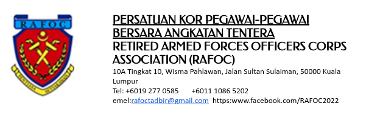

::: {align="center"}
{width="100%"}

# MINIT MESYUARAT AGONG TAHUNAN {#section}

### Siri 25/2025 pada 23/11/2025 {#siri-pada}
:::

### HADIR

  -----------------------------------------------------------------------
  Name                                Designation
  ----------------------------------- -----------------------------------
  Lt Jen Dato' Sri Abdul Aziz bin     Presiden
  Ibrahim, (Bersara)                  

  Laksma Mohamad Imran bin Abd Hamid, Timbalan Presiden
  TLDM, (Bersara)                     

  Brig Jen Dato' Adnan bin Ali,       Naib Presiden, Darat
  (Bersara)                           

  Lt Kdr Phua Hean Sim, TLDM,         Naib Presiden, Laut
  (Bersara)                           

  Mej Jen Dato' Zaharin bin Ahmad,    Naib Presiden, Udara
  TUDM, (Bersara)                     

  Lt Kol Abdullah Khir bin Mohd       Bendahari Kehormat
  Saidi, TUDM, (Bersara)              

  Kol Mohd Kamal bin Omar, (Bersara)  AJK Darat

  Lt Kol Dzulkarnain bin Abdullah,    AJK Darat
  (Bersara)                           

  Kdr Syed Salim bin Syed Osman,      AJK Laut
  TLDM, (Bersara)                     

  Lt Kol Hj Mior Mohamad Zubir bin    AJK Laut
  Mior Yahya, TUDM, (Bersara)         

  Mej Jen Dato' Hj Mohd Hassan bin    AJK Udara
  Loman (Bersara)                     

  Lt Kol Ramli bin Kinta (Bersara)    AJK Terbuka

  Lt Kol Mohd Yusof bin Abd Razak     AJK Terbuka
  (Bersara)                           

  Kol Hamdan bin Yaccob (Bersara)     AJK Terbuka

  Lt Kol Hashimah bt Hj. Hassan TUDM, Lembaga Rayuan/TM
  (Bersara)                           

  Mej Noh bin Atan @ Khamis (Bersara) Setiausaha Kehormat
  -----------------------------------------------------------------------

### TIDAK HADIR (DENGAN MAAF)

  Name                                            Designation
  ----------------------------------------------- ---------------------
  Lt Kdr Hj. Yusalie bin Yushak TLDM, (Bersara)   AJK Darat
  Kapt Asmah bt Abdul Kadir (Bersara)             AJK Terbuka
  Mej Amir Ahmad bin Abd Majid, (Bersara)         Pemeriksa Kira-Kira
  Kept Tajudin bin Hj Yahya, TLDM, (Bersara)      Pemeriksa Kira-Kira
  Mej Harbans Kaur ap Chanan Singh (Bersara)      Lembaga Rayuan
  Mej Ismail bin Malik, TUDM, (Bersara)           AJK Udara

------------------------------------------------------------------------

### AGENDA 1: UCAPAN PEMBUKAAN OLEH PRESIDEN

1.  Dato Sri Presiden mengalu-alukan kehadiran semua dengan ucapan
    terima dan memohon semua Ahli EXCO meng hadiahkan Al Fatehah kepada
    Allahyarham mantan Presiden RAFOC Jen Tan Sri Abdul Rahman Abdul
    Hamid. Secara ringkasnya Dato Sri Presiden mengingatkan semua Ahli
    EXCO untuk sama-sama mengangkat RAFOC ke tahap yang akan boleh
    dibanggakan oleh kalangan Pegawai-Pegawai Veteran. Keutamaan RAFOC
    adalah untuk menilai perkara-perkara berikut:\

<!-- -->

a.  Kedudukan pejabat RAFOC. Presiden berharap DMHL masih mempunyai
    pertalian yang rapat dengan kepimpinan semasa untuk meneroka peluang
    mendapat bangunan untuk RAFOC beroperasi.\
b.  Peka dan keterlibatan dengan isu-isu yang berkaitan dengan veteran.

<!-- -->

2.  **Keputusan:** Makluman.

### AGENDA 2: "MENGESAHKAN MINIT MESYUARAT EXCO RAFOC SIRI 01/2021 PADA 9 NOV 2021.

3.  Minit Mesyuarat Siri 01/2020 bertarikh 9 Nov 2021 diluluskan oleh
    LMI dan disokong oleh LCYR tanpa sebarang pindaan.

4.  **Keputusan:** Makluman.

### AGENDA 3: MENGESAHKAN KOMPOSISI BARISAN EXCO BAGI PENGGAL PERTAMA (TAHUN 2022 - 2023)

5.  Senarai sepertimana maklumat kehadiran pada mukasurat 1 minit ini
    adalah barisan EXCO bagi penggal pertama (2022 -- 2023). Kecuali
    Pemeriksa Kira-Kira Kehormat (Perlantikan satu (1) tahun dan boleh
    dilantik semula pada tahun-tahun berikutnya).

6.  **Keputusan:** Makluman.

### AGENDA 4: PERLAKSANAAN SERAH AMBIL ALIH SETIAUSAHA KEHORMAT (SUK) DAN BENDAHARI KEHORMAT (BK)

7.  Dokumentasi serah ambil alih kedua-dua portfolio SUK & BK telah
    dilaksanakan, kecuali pertukaran penanda tangan EXCO-EXCO yang
    baharu belum dimajukan ke bank kerana memerlukan dokumen-dokumen
    kuasa pertukaran (Pengesahan Minit Mesyuarat yang meluluskan
    perjawatan-perjawatan yang baru dengan penandatangan-penandatangan
    yang baru perlu di majukan mengikut borang/proforma bank yang
    terkini.\
    Mesyuarat telah meluluskan penanda tangan keatas cek-cek RAFOC untuk
    perbelanjaan-perbelanjaan berikut:\

<!-- -->

a.  Semua pembayaran melaui cek / pindahan bank / atau cara-cara
    perbankan-perbankan lain hanya boleh ditanda tangani oleh Ahli-Ahli
    EXCO berikut:\
b.  Bendahari Kehormat dan Presiden atau\
c.  Bendahari Kehormat dan Timbalan Presiden atau\
d.  Bendahari Kehormat dan Setiausaha Kehormat

<!-- -->

8.  **Keputusan:** BK perlu segerakan urusan-urusan dokumentasi
    perbankan dengan bantuan SUK.

### AGENDA 5: KEDUDUKAN KEWANGAN RAFOC BERAKHIR 28 FEB 2022

9.  Aliran Tunai bagi tempuh berakhir 28 Feb 2022. Rujuk kembaran A.

10. **Keputusan:** Makluman.

### AGENDA 6: SEMAKAN KEDUDUKAN TUNAI DALAM BANK

11. SUK memberi penerangan berkenaan mengakses akaun semasa RAFOC
    melalui internet. \> Akses internet \> Laman web BizChannel@CIMB \>
    Coy ID, key-in: B180220, \> User ID: RAFOC02, it will furnish secure
    word: Veteran, click yes \>\> enter user PW: Wwg201097 and an OTP
    will be sent to your HP for keying in on the requested screen (HP
    must 1st be registered with the bank). It's for the purpose of
    accounts monitoring, checking of transactions & monthly Bank
    Statement in a timely manner \[realtime\]).

12. **Keputusan:** Makluman.

### AGENDA 7: MENGAKTIFKAN DAN MELANTIK PIMPINAN BIRO-BIRO RAFOC MENGIKUT PERUNTUKAN PERLEMBAGAAN

13. Biro Pampasan & Kesejahteraan (Compensation & Wellness). Dipimpin
    oleh Dato Adnan.

14. Biro Pertahanan & Strategik (Defence & Strategic). Dipimpin oleh
    Dato Zaharin.

15. Biro Keahlian & Sumber (Membership and Resources). Semua Naib
    Presiden Darat, Udara & Laut perlu mencari inisiatif untuk mengorak
    perancangan yang sewajarnya.

16. Sukan & Rekreasi. KRK. Rancangan aktiviti golf selepas raya.Lt Kdr
    Yusalie akan membantu KRK dalam pengurusan acara-acara golf.

17. Penjanaan Dana. Diterajui oleh Timbalan Presiden.

18. Acara peringatan & sosial (Etika majlis-majlis & tingkah laku/Etika
    Whatsapp. Dipimpin oleh Dato' Zaharin. JK Kecil Majlis Raya RAFOC
    yang disyorkan pada 28 May 2022.

19. Majlis makan malam 2022. Dato Hassan dengan dibantu oleh Lt Kol Mior
    Zubir sebagai Setiausaha.

20. Admin kepada FB RAFOC. KHY.

21. Jawatankuasa Media. Dianggotai oleh Kol Hamdan, Lt Kol Dzul, Lt Kol
    Yusuf & SUK.

22. **Keputusan:** Makluman.

### AGENDA 8: PEJABAT RASMI RAFOC & STAF PEMBANTU PENTADBIRAN & AKAUN

Alamat. 10 A, Tingkat 10, Wisma Pahlawan, Jalan Sultan Sulaiman, 50000
Kuala Lumpur. Staf Pembantu Pentadbiran & Akaun. Memohon Sdr Lokman bin
Mohamad Satir, dilantik secara tetap semula mulai 1 April 2022. Untuk
makluman RAFOC telah menggunakan khidmat beliau secara "Need basis"
sejak persiapan AGM dan tugas-tugas mengemaskini maklumat ahli-ahli
dalam Daftar Ahli RAFOC seperti yang dikehendaki oleh JHEV melalui
sistem maklumat JHEV.

23. **Keputusan:** Buat masa ini kekal sebagai pejabat pentadbiran
    RAFOC. Mesyuarat sebulat suara bersetuju melantik Sdr Lokman sebagai
    staf yang dibayar elaun bulanan RM1,500.00 dengan caruman SOCSO
    (Ikut SOP SOCSO) dan diberi elaun telefon bimbit sebagai talian am
    pejabat RAFOC.

### AGENDA 9: TAKWIM MESYUARAT 2022 -- 2023

24. Takwim mesyuarat 2022 -- 2023. Merujuk kepada klausa 19 b.
    Perlembagaan RAFOC, Satu (1) mesyuarat EXCO sekurang-kurangnya
    setiap tiga (3) bulan dalam satu (1) tahun kalender perlu diadakan,
    atau atas penerimaan oleh SUK daripada tidak kurang daripada
    lapan (8) Ahli EXCO yang memohon secara bertulis kepada SUK.

25. **Keputusan:** Mesyuarat memutuskan untuk mengadakan
    mesyuarat-mesyuarat EXCO pada bulan ketiga setiap penggal (1 penggal
    -- 3 bulan), dan memilih hari selasa terakhir pada bulan berkenaan
    sebagai tarikh Mesyuarat EXCO seperti berikut:\

<!-- -->

a.  Mesyuarat EXCO 2022 & AGM 2022\
    (1). 15 Mar 2022\
    (2). 22 Jun 2022\
    (3). 27 Sep 2022\
    (4). 27 Dis 2022\
    (5). AGM: 19 Feb 23\
b.  Mesyuarat EXCO 2023 & AGM 2023\
    (1). 28 Mar 2022\
    (2). 27 Jun 2022\
    (3). 26 Sep 2022\
    (4). 26 Dis 2022\
    (5). AGM: Feb 23

### AGENDA 10: HAL-HAL LAIN

Penasihat Undang-undang. RAFOC akan menghubungi Mej Jen Dato Che Hasni
untuk dapat persetujuan. Kunjungan hormat. RAFOC akan menulis kepada
senarai berikut untuk merancang membuat kunjungan hormat kepada:\
1.1 Raja Perlis\
1.2 Sultan Kedah\
1.3 Menteri Pertahanan\
1.4 Timbalan Menteri Pertahanan\
1.5 PAT\
1.6 Chief Circle

------------------------------------------------------------------------

### PENUTUP

Penutup. Pengerusi mengucapkan terima kasih kepada semua yang hadir dan
mengharapkan semua barisan EXCO dapat menyumbang dengan sebaik mungkin
untuk memacu RAFOC ke tahap yang boleh dibanggakan oleh warga Veteran.

**Disediakan Oleh:**\
Mej Noh bin Atan (B)

**Diluluskan Oleh:**\
....................
